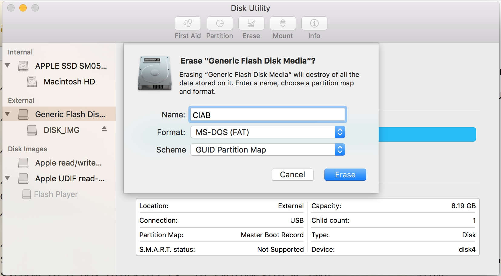

# How to Classroom in a Box

### Copy files from the CentOS ISO after mounting it.

1. All of the following commands will be run on a Mac laptop.

1. Insert an 8Gb (or larger) USB key into a Mac laptop and use `Disk Utility` to erase it with the following settings:
    * Name:   `CIAB`
    * Format: `MS-DOS (FAT)`
    * Scheme: `GUID Partition Map`

    Make sure to select the flash drive itself and not any existing disk image already present on the drive before erasing. Use the `Edit->Erase...` menu to start the erasing process.

1. The flash drive should now be mounted on the directory `/Volumes/CIAB`.
    
1. Download the following CentOS ISO: [CentOS-7-x86_64-Everything-1611.iso](http://vault.centos.org/7.3.1611/isos/x86_64/CentOS-7-x86_64-Everything-1611.iso)

1. Attach the ISO file as a disk device but don't mount:  
    `hdiutil attach -nomount CentOS-7-x86_64-Everything-1611.iso`

1. Note the output of the `hdiutil` command, as it will display the new disk device associated with the ISO file, e.g.:  

   `/dev/disk5          	FDisk_partition_scheme`  
   `/dev/disk5s2        	0xEF`  

   In this case, `/dev/disk5` is the new disk device associated with the ISO file and will be used in the `mount_cd9660` command below.

1. Make a temporary directory to mount the ISO disk device. This directory can be located anywhere and named anything. It merely serves as a mountpoint, and the files in the ISO file will appear within it once the ISO file has been mounted.  
    `mkdir files`

1. Mount the device displayed by `hdiutil` to the new directory:  
    `mount_cd9660 /dev/disk5 files`

1. Copy all of the files from the `./files` directory to the root of the USB drive:  
    `cp -R ./files/* /Volumes/CIAB`
    
    This process will take some time as it is copying 8Gb of data to a slow flash drive.
    
1. Unmount the ISO file from the `files` directory:  
   `umount /dev/disk5`
   
1. Detach the ISO file to clean up the disk device:  
   `hdiutil detach /dev/disk5`

### Copy files from this directory.

1. Clone this repository somewhere on the laptop:  
    `git clone git@github.com:puppetlabs/education-builds.git`
    
1. cd to the `classroom_in_a_box` directory:  
    `cd education_builds/classroom_in_a_box`
    
1. Copy the `ks` directory to the USB drive:  
    `cp -R ./ks /Volumes/CIAB`
    
1. Copy the grub.cfg to the USB drive:  
    `cp EFI/BOOT/grub.cfg /Volumes/CIAB/EFI/BOOT/grub.cfg`
    
1. Eject the flash drive, insert it into the NUC, and power on the NUC. If prompted, press `F10` to display the boot menu and select the flash drive as the boot device. From here, the installation should continue unattended, and after 60-90 minutes, the NUC should be configured as a "Classroom in a Box" machine.

1. At the end of the installation process, the NUC will reboot and display a login screen that includes the root password. You may also log in with the default username `training` and the default password `training`.